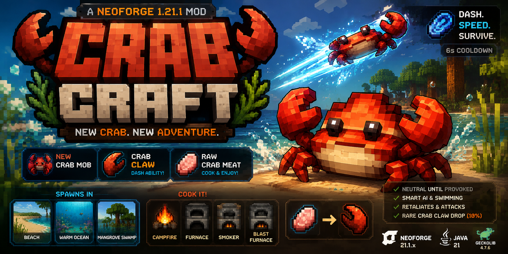
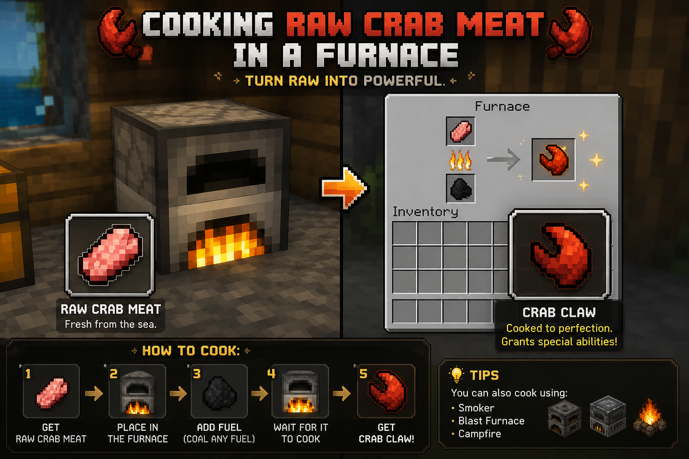

# CrabCraft

CrabCraft is a **Minecraft Java Edition** mod for **NeoForge 1.21.1** that adds a custom crab mob, crab-themed items, and a movement ability system.



## Features

- New custom mob: **Crab**
- Neutral by default, becomes hostile when attacked
- Crab AI:
  - Swimming and water path support
  - Random strolling near beaches/water
  - Avoids zombies
  - Retaliation + melee attack goals
- Biome spawning in:
  - Beach
  - Warm Ocean
  - Mangrove Swamp
- Crab drops:
  - **Raw Crab Meat** (common)
  - **Crab Claw** (rare, 10%)
- **Crab Claw** (consumable ability item):
  - Sideways dash on consume
  - Speed effect (2s)
  - Temporary knockback resistance handling
  - Splash + trail particles
  - 6-second cooldown
- Cooking support:
  - Campfire
  - Furnace
  - Smoker
  - Blast Furnace

## Tech Stack

- Minecraft: `1.21.1`
- Loader/API: `NeoForge 21.1.x`
- Java: `21`
- Animation library: `GeckoLib 4.7.6`

## Project Structure

```text
com.ashu.crabcraft
├── client/
├── entity/
├── event/
├── item/
├── network/
├── registry/
└── util/
```

## Required Assets

These files are expected in `src/main/resources/assets/crabcraft/`:

- `textures/entity/crab.png`
- `textures/item/crab_claw.png`
- `textures/item/raw_crab_meat.png`
- `geo/crab.geo.json`
- `animations/crab.animation.json`
- `lang/en_us.json`

## Build

```bash
./gradlew build
```

## Run Client (Dev)

```bash
./gradlew runClient
```

## In-Game Quick Test

1. Spawn a crab using the `crab_spawn_egg`.
2. Verify crab movement, swimming, and hostility when attacked.
3. Obtain `raw_crab_meat` from crab drops.
4. Cook raw crab meat to get `crab_claw`.
5. Consume crab claw and verify dash ability + cooldown.

## Cooking Guide



## Notes

- Crab rendering/grounding has been tuned in code via renderer offset.
- If you re-author the crab model, you may want to re-tune renderer Y offset in `CrabRenderer`.

## License

MIT
